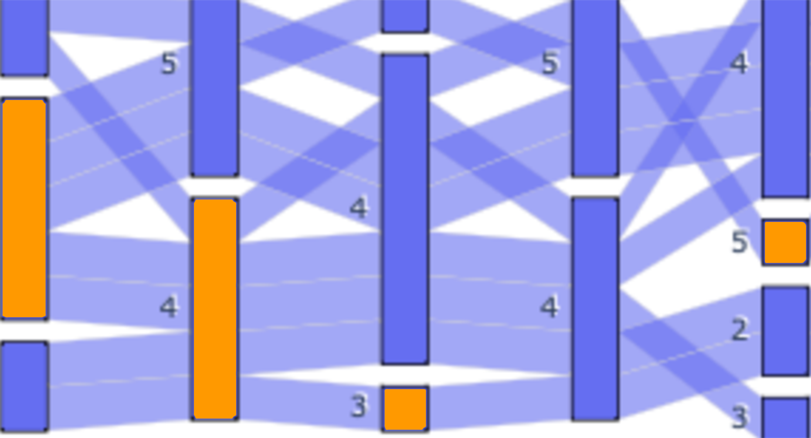
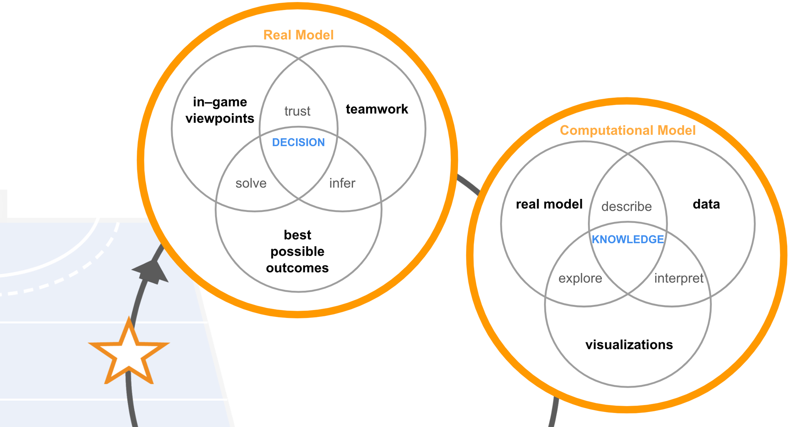
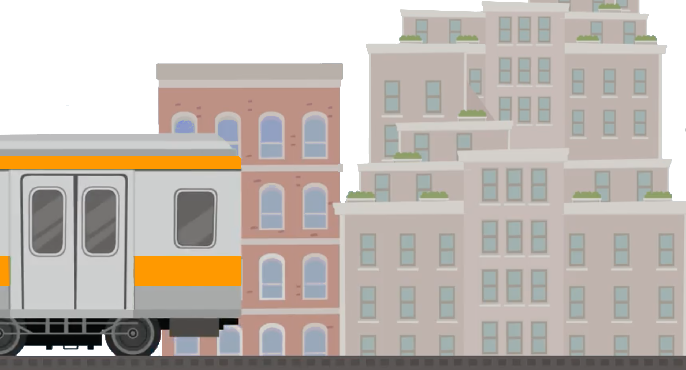

<html lang="en">
<head>
<meta charset="utf-8">
<meta name="viewport" content="width=device-width, initial-scale=1">

</head>

<body>
  

  <h1>Design by Tina Leard</h1>
  

  
   
  

  

<b>Interested in the evolution of communication within digital spaces. Experience in human-computer interaction for learning and performance. Through linguistic and psychological lenses, explore language and feedback loops within systems for knowledge.</b>
  
   
   
  
   
<a href="research.html"><b>Research</b>
  
 
   
  
</a>
  

  
    
<a href="hci.html"><b>Human-computer</b>
  
 
    
  
</a>
  

  
   
<a href="interactive.html"><b>Interactive</b>
  
 
    
  
</a>
  

  
<b>&#169; Tina Leard 2023</b> 
  <a href="https://github.com/TinaL5" target="blank">github.com/TinaL5</a>

  
  
</body>
