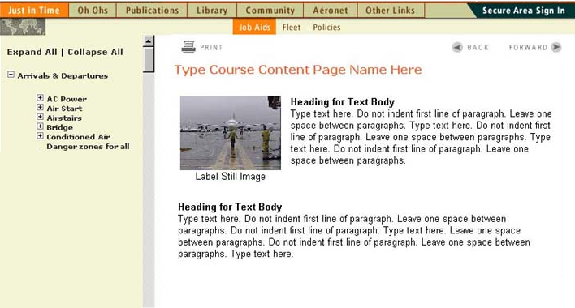

<html lang="en">
<head>
<meta charset="utf-8">
<meta name="viewport" content="width=device-width, initial-scale=1">

</head>

<body>
  

  <h1>Learning Systems by Tina Leard</h1>

  
  
<a href="blended.html"><b>Blended learning</b>
    
 
    
    
</a>
  

  
  
<a href="hci.html"><b>Human&#8211;computer</b>
    
 
    
  
</a>
  

  
  
<a href="literacy.html"><b>Design for literacy</b>
    
 
    
  
</a>
  
 
  

  
 
<a href="design.html"><b>Interactive design</b>
  
 
    
  
</a>
  

  
 
<a href="analytics.html"><b>Learning analytics</b>
  
 
    
  
</a>
  

  
<a href="lms.html"><b>Learning management</b>
    
 
    
  
</a>
  

  

  
Updated April 2021

  
</body>
